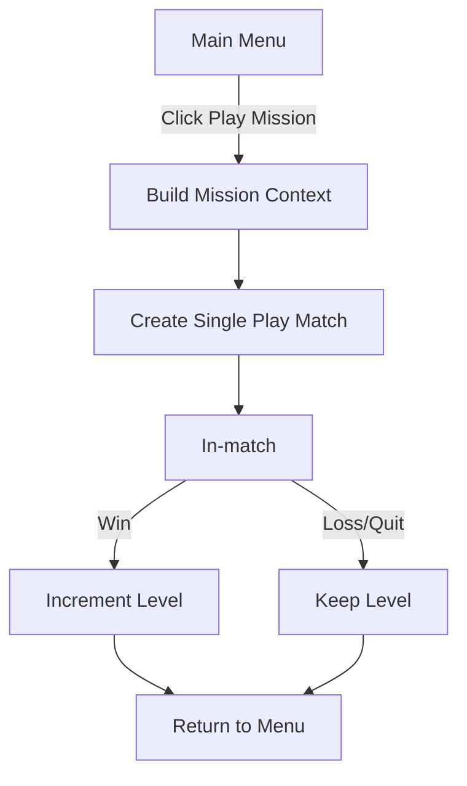

# Feature Spec — Single‑Play Missions (Levels)

## 0) Role Alignment
I own the design of Single‑Play Missions and will deliver an engineer‑ready package for implementation and QA.

Source spec basis: role prompt v1. 

---

## 1) Overview
### Problem
Single Play lacks structured progression. Players either repeat similar matches or bounce after a loss because there is no clear “next step.”

### Objective
Add a mission ladder that reuses existing Single Play systems while delivering:
- clear next objective (mission number)
- predictable difficulty ramp
- minimal UI surface (one button)
- deterministic config (for debugging/QA)

### Success metrics (initial)
- Mission start → mission end completion ≥ 60% for L ≤ 5
- Replays in first session +10% vs baseline Single Play
- Median duration stays inside the selected map’s expected band

---

## 2) Scope
### In
- New entry button in main menu above existing Single Play
- “Next mission” progression (no level picker)
- Mission builder: map selection + nation-bot difficulty ramp
- Mission building happens server-side (LocalServer); client passes only `level`
- localStorage persistence for next mission level

### Out
- Multiplayer changes
- Rewards / meta‑economy / cosmetics
- Mission selector UI
- New maps
- New win conditions

Constraints and V1 rules are fixed per role prompt. 

---

## 3) Assumptions (explicit)
- Single Play currently supports: selecting a map, spawning bots, spawning NPC nations from map manifests.
- Map metadata includes: `id`, `name`; `maxPlayers` is derived from existing player-count config (numPlayersConfig).
- There is a stable difficulty enum: `Easy < Medium < Hard < Impossible`.
- Single Play difficulty is currently global; missions only override NPC nation difficulty.
- Existing Single Play win/loss logic stays unchanged.

---

## 4) Decisions Required (set defaults now)
These are implementation‑blocking, so defaults are declared; change only if Producer overrides.

1) **When to increment level**
- Default: increment only on victory.
- Loss/quit: no change.

2) **Nation-bot handling**
- Default: difficulty ramp targets NPC nations only; bot count stays the same as current Single Play.

3) **Deterministic seed (consistent across clients)**
- Default: derive RNG seed deterministically from `(MISSION_SEED_VERSION, mapId, level)`.
- Same `level` yields the same nation difficulty distribution on all clients (given the same map list and sorting rule).
- Store derived `seed` in mission context for reproducibility.

4) **Difficulty ramp parameters (divisors + clamps)**
- Default divisors per role prompt: `medium=1, hard=10, impossible=50`.
- Mandatory clamp to prevent early spikes (see §7.5).

---

## 5) UX
### Placement
- Main menu: add a primary button above existing **Single Play**.

### Copy
- EN: `Play Mission: {X}`
- RU: `Играть миссию: {X}`

### States
- Normal: clickable.
- Disabled:
  - Single Play unavailable
  - no maps available
- Loading: while mission is being built and match is being created.

### Wireframes (ASCII)
```
[ Play Mission: 3 ]
[ Single Play     ]
[ Multiplayer     ]
```

Disabled with tooltip:
```
[ Play Mission: 3 ] (disabled)
tooltip: No maps available
```

### Flow


---

## 6) Rules

### 6.1 Level / Progression
- Level `L` is 1‑based.
- On win: `L = L + 1`.
- On loss/quit: `L` unchanged.

### 6.2 Map selection
Goal: earlier missions pick smaller lobbies (proxy for easier).

Algorithm:
- Sort maps by `maxPlayers ASC`, then by `id ASC` (using existing player-count config).
- Let `N = mapsSorted.length`.
- Index `i = (L - 1) mod N`.
- Map = `mapsSorted[i]`.

This matches role prompt V1. 

### 6.3 Bot difficulty assignment (baseline)
- Keep the existing Single Play bot-spawn count logic unchanged.
- Apply the mission difficulty ramp only to **nation-bots** (NPC nations).
- Bots retain the existing Single Play difficulty setting.
- RNG is seeded deterministically per mission so assignment is consistent across clients (see §7.2).

### 6.4 Win/Loss
- Reuse existing Single Play win/loss conditions.
- Missions do not introduce special objectives in V1.

---

## 7) Mission Builder

### 7.1 Inputs
- `level L`
- `maps[]` (map list + derived `maxPlayers`)
- `mapManifest.nations[]` (from map manifest)
- `currentSinglePlayBotCount`
- `difficulty enum`
- `rng seed` (derived deterministically; see §7.2)

### 7.2 Deterministic seed derivation
Seed must be deterministic and identical across clients.

Constants:
- `MISSION_SEED_VERSION = "spm:v1"` (bump when mission generation logic changes)

Definition:
- `seed = hash32(MISSION_SEED_VERSION + ":" + mapId + ":" + level)`

Hash requirements:
- deterministic across platforms
- returns unsigned 32-bit integer

Recommended: FNV-1a 32-bit (or MurmurHash3 32-bit). Choose one and keep it fixed.

### 7.3 Outputs
A mission context object consumed by Single Play match creation:
```json
{
  "mode": "single_play_mission",
  "level": 7,
  "mapId": "map_small_02",
  "bots": 400,
  "nationDifficulties": [
    {"nationIndex": 0, "difficulty": "Medium"},
    {"nationIndex": 3, "difficulty": "Easy"}
  ],
  "seed": 123456789
}
```
Note: `nationDifficulties` should be stored as a full list aligned to the manifest order, or as a sparse list where missing entries default to `Easy` (pick one and keep it consistent).

### 7.4 Difficulty coefficient
- `C = L`.

### 7.5 Upgrade counts (divisors + clamps)
Base counts per role prompt:
- `mediumCount = floor(C / MEDIUM_DIV)`
- `hardCount = floor(C / HARD_DIV)`
- `impossibleCount = floor(C / IMPOSSIBLE_DIV)`

Default divisors (tunables):
- `MEDIUM_DIV = 1`
- `HARD_DIV = 10`
- `IMPOSSIBLE_DIV = 50`

Monotonic progression safeguards:
- Compute the final per-tier target counts; tiers can be skipped (it is valid to have zero Easy/Medium/Hard nations).
- Clamp the total to `nationCount` and prevent overlap by allocating from the top tier down:
  - `impossibleCount = min(nationCount, floor(C / IMPOSSIBLE_DIV))`
  - `hardCount = min(nationCount - impossibleCount, floor(C / HARD_DIV))`
  - `mediumCount = min(nationCount - impossibleCount - hardCount, floor(C / MEDIUM_DIV))`
  - `easyCount = nationCount - impossibleCount - hardCount - mediumCount`

Implication: difficulty is non-decreasing with level and eventually reaches the terminal state where all nations are `Impossible` once `L >= IMPOSSIBLE_DIV * nationCount`.

### 7.6 Difficulty assignment method
Assign final difficulties directly (no requirement to pass through lower tiers):
- Choose `impossibleCount` distinct nation indices → set to `Impossible`.
- From remaining indices, choose `hardCount` → set to `Hard`.
- From remaining indices, choose `mediumCount` → set to `Medium`.
- All remaining indices are `Easy`.
- Nation indices map to the manifest order for the selected map.

Selection is uniform random over remaining candidates at each step.

Determinism:
- Seed is derived deterministically from `(MISSION_SEED_VERSION, mapId, level)`.
- RNG implementation must be identical across clients (do not use platform-default RNG).

### 7.7 Pseudocode
```pseudo
function buildMission(L, maps):
  assert maps.length > 0
  mapsSorted = sortBy(maps, maxPlayers ASC, id ASC)
  map = mapsSorted[(L - 1) % mapsSorted.length]

  seed = hash32(MISSION_SEED_VERSION + ":" + map.id + ":" + L)

  botCount = currentSinglePlayBotCount()
  nations = map.manifest.nations

  C = L
  counts = computeTierCounts(C, nations.length)

  rng = seededRng(seed)
  nationDifficulties = assignNations(nations.length, counts, rng)
  return { level: L, mapId: map.id, bots: botCount, nationDifficulties, seed }
```

---

## 8) Config Schema
Purpose:
- V1 uses algorithmic defaults.
- Schema enables future predefined overrides and A/B tuning.

### 8.1 Schema (V1)
```json
{
  "$schema": "geoconflict://schemas/mission-config-v1.json",
  "id": "spm-0001",
  "level": 1,
  "mapId": "map_small_02",
  "bots": 400,
  "nationCount": 12,
  "difficulty": {
    "coefficient": 1,
    "divisors": { "medium": 1, "hard": 10, "impossible": 50 },
    "seed": { "mode": "DERIVED", "version": "spm:v1", "hash": "FNV1A_32" },
    "rngSeedOverride": null
  },
  "nationDifficulties": [
    { "nationIndex": 0, "difficulty": "Medium" }
  ],
  "overrides": {
    "startingResourcesMult": 1.0,
    "fogOfWar": true,
    "timeLimitSec": null
  },
  "winCond": { "type": "INHERIT_SINGLE_PLAY" },
  "lossCond": { "type": "INHERIT_SINGLE_PLAY" }
}
```

### 8.2 How it applies in V1
- If a config exists for level `L`, use its explicit overrides.
- Else, use algorithmic builder.

This preserves the “predefined configs” direction without requiring a full authoring pipeline in V1.

---

## 9) Data & Storage
### 9.1 localStorage keys
- `geoconflict.sp.nextMissionLevel` → integer, default `1`.
- Optional: `geoconflict.sp.lastCompletedAt` → ISO string.

Storage rule is fixed per role prompt. 

### 9.2 Migration
- None. Initialize on first access if missing/invalid.

### 9.3 Validation
- If stored value is NaN / <1: reset to 1.

---

## 10) Testing
### Unit
- Map sorting and index wrap
- localStorage get/set with validation
- Upgrade counts with clamps
- Upgrade order enforcement
- At least one Easy nation preserved when possible

### Property / fuzz
- Determinism: same `(level, mapId)` → same derived seed → same nation distribution
- Distribution sanity for large L

### E2E
- Button shows correct level
- Win increments level
- Loss/quit does not increment
- Disabled state when no maps

### Edge cases
- `maps.length == 0`
- only 1 map present
- map list changes between sessions
- nationCount smaller than requested upgrades

---

## 11) Risks & Mitigations
1) **Early difficulty spike** (MEDIUM_DIV=1)
- Mitigation: tune divisors per map band if needed; monotonic progression still guarantees eventual all‑`Impossible` end‑state without plateau.

2) **Perceived inconsistency if map list changes**
- Mitigation: log `mapId` with mission; cycling prevents crashes.

3) **Player confusion about missions vs Single Play**
- Mitigation: copy uses explicit “Mission” label; button placement above Single Play.

4) **Debug difficulty without picker**
- Mitigation: dev panel hook to set `L` and optionally override `seed` / `MISSION_SEED_VERSION` (dev only).

---

## 12) Engineer Task Breakdown (ordered)
1) **UI**: add button above Single Play; RU/EN label; loading/disabled/tooltip.
2) **Storage**: `getNextMissionLevel()` / `setNextMissionLevel()`.
3) **Maps**: expose sorted map list and selection helper.
4) **Mission Builder**: implement algorithm + clamps + deterministic seed derivation + seeded RNG.
5) **Nation difficulty integration**: apply per-nation difficulty to match creation.
6) **Dev hooks** (dev only): override `L`, optionally override `seed`, dump nation distribution.
7) **Tests**: unit + E2E; seed snapshots.

File paths are repo‑dependent; treat as TODO placeholders until codebase structure is confirmed.

---

## 13) Implementation Notes (non‑functional)
- Runtime overhead: O(nationCount) per mission build.
- Determinism: `seed` is derived deterministically; do not persist seed in storage.
- Compatibility: bump `MISSION_SEED_VERSION` when mission generation logic changes to avoid silent seed drift across versions.
- Security: localStorage is non‑authoritative; acceptable for single player.
